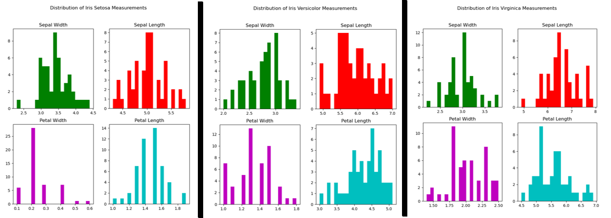
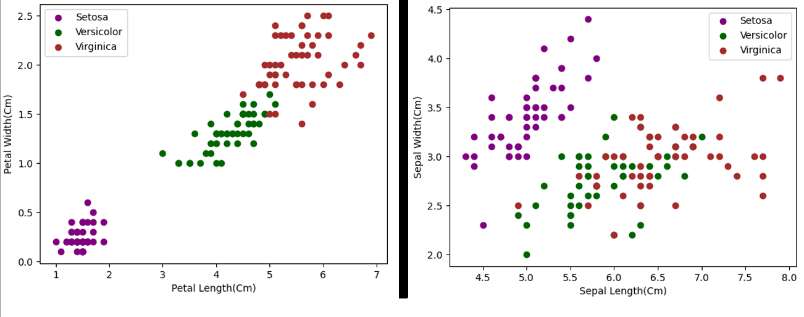
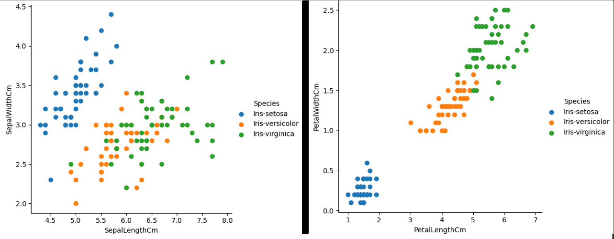
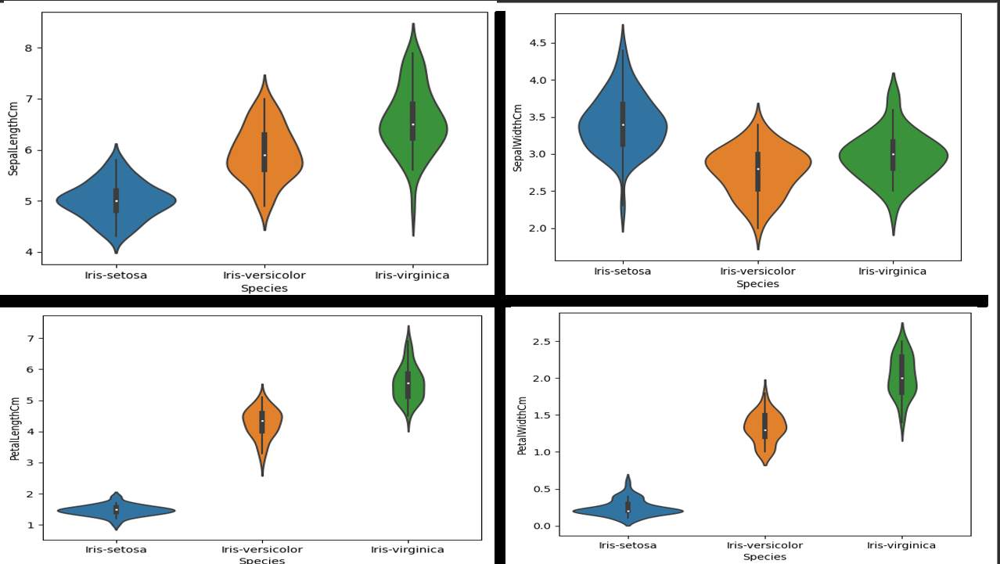
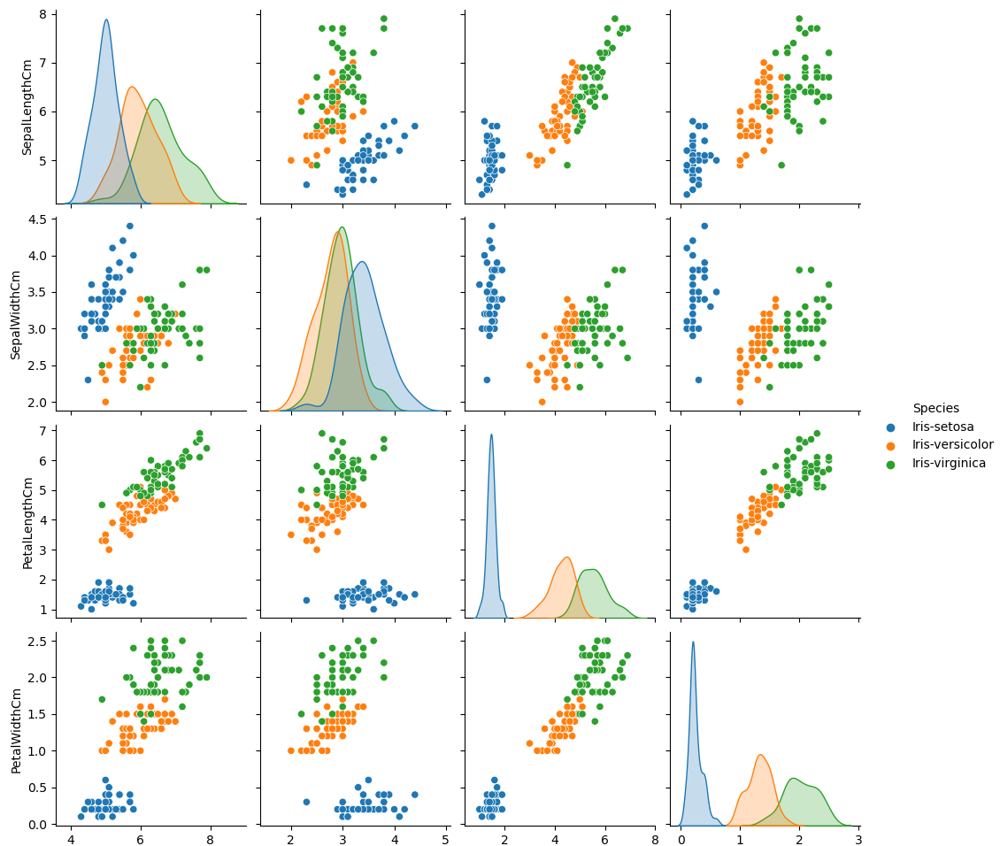

# Programming & Scripting Project

## Author: Paul Callaghan

### Project Name:

Iris Dataset Analysis

### Project Description:

This project is intended to present the Fisher Iris dataset in a meaningful manner by utilising the Python programming language to create at least a histogram, a scatterplot and a summary text file (with possibly more to be added).

#### Table of Contents

- [Initial Research](#initial-research)
- [Creating User Menu](#creating-user-menu)
- [Usage](#usage)
- [Findings](#findings)
- [References](#references)

#### Initial Research

Based on Chapter 3 (section 2) of 'Mark Fenner's Machine Learning with Python for Everyone', the dataset is named after Sir Ronald Fisher, a statistician from the mid-20th century however it was in fact Edgar Anderson that gathered the data.

The dataset is considered a key component of training for 'statistics or machine learning' (Cui, 2020). 

In the dataset, there are four measurements per iris - sepal length, sepal width, petal length and petal width (all in centimetres). The sample size of data for each species is 50 based on there being 50 rows of data for each of the species.

The dataset was downloaded from Kaggle (Retrieved 08/04/2023, from https://www.kaggle.com/datasets/uciml/iris?resource=download). 

The three types of iris are the Iris Setosa, Iris Versicolor and the Iris Virginica.

#### Creating User Menu

The analysis.py script contains the menu where the user can select from 4 functions or to exit the application.

1: 'Output Summary Of Each Variable'

Option 1: The first option in analysis.py is to call the summary_output function which is imported from summary.py. Using Pandas, the IrisDataset.csv is read into a dataframe and grouped by the species type - iris setosa, iris versicolor and iris virginica. 'time' is imported to created a timestamp for unique filenames so user can see when file is written within the name.

A loop is created with variables to output a unique sentence for each of the species types. F-Strings are used for outputting the variables into the text file.

2: 'Save Histogram Of Each Variable'

Option 2: The histogram.py script is imported and contains three functions. Any of these functions can be run when the user selects option 2 from the menu. The functions are based on the plottask.py task from a few weeks ago. Copied functions from summary.py to calculate averages of petal and sepal measurements for each of three iris species.

The sub menu initially caused difficulties when trying to import it as it's own function from histogram.py so I moved the menu itself to the analysis.py file (as sub_menu2) and works as intended after testing.

3: 'Output Scatter Plot Of Each Pair Of Variables'

Option 3: The scatterplot.py script is imported for this and contains two functions - scatterplot_petals and scatterplot_sepals. These functions compare petal sizes across the three species or sepal sizes across the three species. The code was based on the Matplotlib guide accesible on this URL - https://matplotlib.org/stable/gallery/shapes_and_collections/scatter.html#sphx-glr-gallery-shapes-and-collections-scatter-py

4: 'Seaborn Data Visualisation'

The user will be able to select from a list of Seaborn data visualisation options. The idea is to present to the user how Seaborn looks in comparison to Matplotlib as it is a visualisation "library built on top of Matplotlib" (Pierre, 2021).
The options provided are a facet grid, a violin grid and a pair plot. User input facilitates choice through arguments. 
Based on the Kaggle guide here - https://www.kaggle.com/code/rakesh6184/seaborn-plot-to-visualize-iris-data/notebook

5: 'Exit'

#### Usage

##### Prerequisites
Download and install Python (https://www.python.org/downloads/) and Anaconda (https://www.anaconda.com/distribution/).

##### Installing & Running

The project is available here - https://github.com/turps-pc90/pands-project - and all files associated with the project are stored in this repository. It can be cloned by using the following command:

git clone https://github.com/turps-pc90/pands-project.git

Once the project has been cloned or downloaded, navigate to the project director.

Install the required dependencies by using the requirements.txt file provided in the GitHub repository.

Run 'python analysis.py' in your command line to start using the project. All the functions are imported into this file so the whole project should be usable from the command line menu presented from running this file.

#### Findings

The output of the summary indicates that the Iris-setosa species, the sepal has an average length of 5.006cm and an average width of 3.418cm. The petal length has an average of 1.464cm while it's width averages at 0.24cm.
For the Iris-versicolor species, the sepal length has an average of 5.936cm and a width average of 2.77cm. The petal length has an average of 4.26cm and an average width of 1.33cm.
For the Iris-virginica species, the sepal length has an average of 6.59cm. and sepal width average of 2.97cm. The petal length has an average of 5.55cm. The petal width has an average of 2.026cm.

The histograms show that the distributions of sepal width and sepal length are relatively similar for all three species, but there are noticeable differences in the distributions of petal width and petal length. For example, the petal width and petal length measurements for Iris Setosa have a narrower range of values and are generally smaller than those for the other two species. Meanwhile, the petal width and petal length measurements for Iris Versicolor and Iris Virginica have similar distributions, but Iris Virginica's measurements tend to be larger than those of Iris Versicolor.

The scatterplot for petal size would indicate that the petal length and width of the Iris Setosa is significantly smaller than those of the Iris Versicolor (2nd biggest petals of the three) or the Iris Virginica (largest). The scatterplot for sepal length and width would suggest that the Iris Setosa has the widest and shortest sepals while the Iris Virginica and Versicolor sepal lengths and widths are quite varied.

The Seaborn library (screenshots below) appears to give a more modern feel to the charts/grids in comparison to those of the Matplotlib library. The wider variety of options would mean I would be more likely to use this in a future project rather than Matplotlib.

 

 

 

#### References

UCI Machine Learning Repository. (n.d.). Iris Data Set. Kaggle. Retrieved April 8, 2023, from https://www.kaggle.com/datasets/uciml/iris?resource=download.

Cui, Y. (2020). The Iris Dataset: A Little Bit of History and Biology. Towards Data Science. Retrieved from https://towardsdatascience.com/the-iris-dataset-a-little-bit-of-history-and-biology-fb4812f5a7b5

Nemec, A. (2018, December 5). How to write a good README file. freeCodeCamp. Retrieved April 8, 2023, from https://www.freecodecamp.org/news/how-to-write-a-good-readme-file/.

Fenner, M. (2019). Machine Learning with Python for Everyone. Pearson.

Matsiko, F. (2019, June 25). How to Create a Menu for a Python Console Application. Computing Learner. Retrieved April 23, 2023, from https://computinglearner.com/how-to-create-a-menu-for-a-python-console-application/.

Stack Exchange Inc. (2012, May 16). How to create a file name with the current date & time in Python?. Stack Overflow. Retrieved April 23, 2023, from https://stackoverflow.com/questions/10607688/how-to-create-a-file-name-with-the-current-date-time-in-python.

Liu, D. (2021, August 12). Reading and Writing CSV Files in Python. Real Python. Retrieved April 23, 2023, from https://realpython.com/python-csv/.

Real Python. (n.d.). Pandas GroupBy: Your Guide to Grouping Data in Python. Retrieved April 22, 2023, from https://realpython.com/pandas-groupby/#the-hello-world-of-pandas-groupby.

GeeksforGeeks. (n.d.). Pandas GroupBy - One Column and Get Mean, Min, and Max values. Retrieved April 22, 2023, from https://www.geeksforgeeks.org/pandas-groupby-one-column-and-get-mean-min-and-max-values/.

GeeksforGeeks. (2021, January 7). Difference between loc() and iloc() in Pandas DataFrame. Retrieved May 7, 2023, from https://www.geeksforgeeks.org/difference-between-loc-and-iloc-in-pandas-dataframe/.

Schafer, C. (2019, January 7). Matplotlib Tutorial (Part 6): Histograms [Video]. YouTube. https://www.youtube.com/watch?v=XDv6T4a0RNc&t=306s

Matplotlib Development Team. (2021). matplotlib.axes.Axes.hist. Matplotlib 3.4.2 documentation. Retrieved September 27, 2021, from https://matplotlib.org/stable/api/_as_gen/matplotlib.axes.Axes.hist.html.

Pierre, S. (2021, March 11). Data Visualization in Python: A Step-by-Step Tutorial. Built In. Retrieved May 7, 2023, from https://builtin.com/data-science/data-visualization-tutorial.

Rakesh (2021). Seaborn plot to Visualize Iris Data. Kaggle. Retrieved May 7, 2023, from https://www.kaggle.com/code/rakesh6184/seaborn-plot-to-visualize-iris-data/notebook.

#### Packages Used In Project

 - https://www.python.org/downloads/

 - https://pandas.pydata.org/ - "is a fast, powerful, flexible and easy to use open source data analysis and manipulation tool, built on top of the Python programming language."

 - https://matplotlib.org/ - "Matplotlib is a comprehensive library for creating static, animated, and interactive visualizations in Python."

 - https://numpy.org/ - "The fundamental package for scientific computing with Python"
